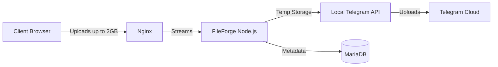

<div align="center">

# 📂 FileForge
### The Limitless File Management Platform


[](LICENSE)
[]()


[Features](#-features) • [Architecture](#-architecture) • [Setup](#%EF%B8%8F-setup-guide) • [Troubleshooting](#-troubleshooting)

</div>

---

**FileForge** is a powerful, open-source web platform designed for seamless file management. It combines a universal media downloader, a powerful file converter, and a limitless cloud storage solution backed by the Telegram API.

> **Key Limitbreaker**: Upload files up to **2 GB**, bypassing the standard 50 MB bot limit by utilizing a self-hosted Telegram Bot API server.

---

## 🚀 Features

| Feature | Description |
| :--- | :--- |
| **☁️ Cloud Storage** | Upload files up to **2 GB**. Files are stored securely in a private Telegram channel but managed via a beautiful web interface. |
| **📥 Universal Downloader** | Download videos and audio from YouTube, TikTok, Instagram, and more (powered by `yt-dlp`). |
| **🔄 File Converter** | Convert images, audio, and documents directly in the browser. |
| **📂 File Explorer** | Drag & drop interface, folder management, trash bin, and favorites. |
| **🌗 Dark/Light Mode** | Fully customizable user interface to suit your preference. |

---

## 🏗 Architecture

To achieve the **2 GB upload limit**, FileForge bypasses the public telegram API limits by using a local instance of the Telegram Bot API.



1.  **Client**: Browser uploads file (up to 2GB) to Nginx.
2.  **Nginx**: Forwards the stream to the FileForge Node.js container.
3.  **FileForge App**: Temporarily streams the file to disk (`/temp`) and forwards it to the Local Telegram API Container.
4.  **Local Telegram API**: Handles the heavy lifting and uploads the large file to the Telegram Cloud.
5.  **Database**: MariaDB stores file metadata (names, folder structure, file IDs).

---

## 🛠 Prerequisites

Before you begin, ensure you have the following:

*   🐧 **Linux Server** (Ubuntu/Debian recommended)
*   🐳 **Docker & Docker Compose** (v2+)
*   🌐 **Nginx** (installed on host as Reverse Proxy)
*   🔒 **Domain Name** with SSL (Let's Encrypt)

---

## ⚙️ Setup Guide

### 1. 🔑 Get Telegram Credentials

You need specific credentials to run the local Telegram server.

<details>
<summary><strong>Step-by-step instructions</strong></summary>

#### A. App ID & Hash
1.  Go to [my.telegram.org](https://my.telegram.org).
2.  Log in with your phone number.
3.  Go to **API development tools**.
4.  Create a new application.
5.  Copy the `App api_id` and `App api_hash`.

#### B. Bot Token
1.  Talk to [@BotFather](https://t.me/BotFather) on Telegram.
2.  Create a new bot (`/newbot`) and get the **Token**.

#### C. Channel ID
1.  Create a private channel on Telegram.
2.  Add your Bot as an **Administrator** to that channel.
3.  Forward a message from the channel to [@JsonDumpBot](https://t.me/JsonDumpBot) to find the ID (starts with `-100...`).

</details>

### 2. 📥 Installation

Clone the repository to your server:

```bash
git clone https://github.com/GhostTz/FileForge.git
cd FileForge
```

### 3. 📝 Configuration (.env)

Create a `.env` file in the root directory:

```bash
nano .env
```

Paste the following content and fill in your details:

```env
# Server Configuration
PORT=3010
DOMAIN=https://your-domain.com

# Database (Docker Internal)
host=db
user=fileforge
password=SECURE_DB_PASSWORD
name=fileforge

# Security
JWT_SECRET=your_super_secret_jwt_key

# Telegram Local Server Config (From my.telegram.org)
TELEGRAM_API_ID=12345678
TELEGRAM_API_HASH=abcdef1234567890abcdef

# DO NOT CHANGE THE URL BELOW
TELEGRAM_API_URL=http://telegram-bot-api:8081
```

### 4. 🐳 Docker Compose

Start the application (App, Database, and Telegram Server):

```bash
docker compose up -d --build
```

### 5. 🌐 Nginx Configuration (Crucial!)

To allow **2 GB uploads**, you must configure Nginx to allow large bodies and long timeouts.

Edit your site config (e.g., `/etc/nginx/sites-available/your-domain.com`):

```nginx
server {
    server_name your-domain.com;

    # 1. ALLOW LARGE UPLOADS (2GB)
    client_max_body_size 2048M; 

    # 2. INCREASE TIMEOUTS (1 Hour)
    proxy_connect_timeout 3600s;
    proxy_send_timeout 3600s;
    proxy_read_timeout 3600s;
    send_timeout 3600s;

    location / {
        proxy_pass http://localhost:3010;
        proxy_http_version 1.1;
        proxy_set_header Upgrade $http_upgrade;
        proxy_set_header Connection 'upgrade';
        proxy_set_header Host $host;
        proxy_cache_bypass $http_upgrade;
    }
}
```

Reload Nginx:

```bash
sudo service nginx reload
```

---

## 🏃‍♂️ Usage

1.  Open your domain in the browser.
2.  Register a new account.
3.  Go to **Settings -> Cloud Settings**.
4.  Enter your **Bot Token** and **Channel ID**.
5.  Go to the **Cloud** tab and upload a file larger than 50MB to test the local server integration.

<details>
<summary><strong>🐳 Docker Command Cheat Sheet</strong></summary>

For users not familiar with CLI commands, here are the most common Docker commands you will need.

#### Start & Update
*   **Start normally** (run in background):
    ```bash
    docker compose up -d
    ```
*   **Rebuild and start** (important after code changes):
    ```bash
    docker compose up -d --build
    ```
*   **Recreate specific container** (e.g., telegram-bot-api):
    ```bash
    docker compose up -d --force-recreate telegram-bot-api
    ```

#### View Logs (Live)
*(Exit logs with `CTRL + C`)*
*   **All containers**:
    ```bash
    docker compose logs -f
    ```
*   **Only App logs**:
    ```bash
    docker compose logs -f app
    ```
*   **Only Telegram Server logs**:
    ```bash
    docker compose logs -f telegram-bot-api
    ```

#### Check Status
*   **See running containers**:
    ```bash
    docker compose ps
    ```
*   **Live Usage (RAM/CPU)**:
    ```bash
    docker stats
    ```

#### Stop & Clean Up
*   **Stop all & remove containers** (Database data is safe):
    ```bash
    docker compose down
    ```
*   **Stop all & DELETE Database data** (⚠️ Caution!):
    ```bash
    docker compose down -v
    ```

#### Enter Container
*   **Log into App container** (Command line):
    ```bash
    docker compose exec app sh
    ```
*   **Log into Database** (SQL commands):
    ```bash
    docker compose exec db mariadb -u root -p
    ```

</details>

---

## 🐛 Troubleshooting

| Error | Cause | Fix |
| :--- | :--- | :--- |
| `413 Request Entity Too Large` | Nginx blocking file or App using public API. | Check `client_max_body_size` in Nginx. Check logs: `docker compose logs telegram-bot-api` (must have `--local`). |
| `504 Gateway Time-out` | Upload took too long, Nginx closed connection. | Increase `proxy_read_timeout` and `send_timeout` to `3600s`. |
| `getaddrinfo EAI_AGAIN db` | DB container crashed or isn't ready. | Run `docker compose down -v` and restart. |

### ❗ Critical: Shared Volumes (Local Server)

If downloads or previews fail with a **404 error** or **"File not found"**, you are missing the **Shared Volume configuration**.

Since Docker containers are isolated, the App cannot access files saved by the Telegram Server. You must mount the same host directory to the same path in **both** containers.

**Required `docker-compose.yml` configuration:**

```yaml
services:
  telegram-bot-api:
    image: aiogram/telegram-bot-api:latest
    environment:
      - TELEGRAM_LOCAL=true
    volumes:
      - ./telegram-data:/var/lib/telegram-bot-api  # <--- REQUIRED HERE

  app:
    build: .
    environment:
      - TELEGRAM_API_URL=http://telegram-bot-api:8081
    volumes:
      - ./telegram-data:/var/lib/telegram-bot-api  # <--- REQUIRED HERE TOO (Exact same path!)
```


---

## 📜 License

This project is licensed under the **GPL-3.0 License**. You are free to use, modify, and distribute it, provided you keep the source open.

Built with ❤️ by [GhostTz](https://github.com/GhostTz)